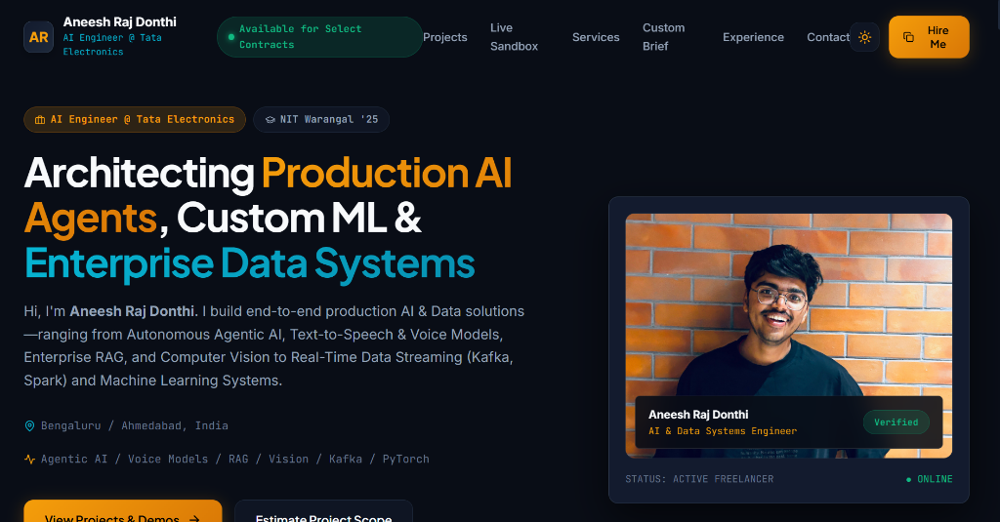

# Aneesh Raj Donthi — Bespoke AI & Data Systems Engineering Portfolio

A bespoke, non-AI-generated freelance portfolio and engineering showcase for **Aneesh Raj Donthi** (AI Engineer @ Tata Electronics | NIT Warangal '25). 

---

## 🌟 Core Technical Focus & Freelance Capabilities

* **Agentic AI & Multi-Agent Workflows:** Autonomous agents, tool execution, LangChain / AutoGen / CrewAI orchestration, MCP protocol servers.
* **Text-to-Speech & Voice AI Models:** ElevenLabs, OpenAI Whisper, low-latency real-time voice streaming pipelines.
* **Enterprise Document RAG & Vector Search:** Hybrid ChromaDB / Qdrant vector engines, sliding-window chunking, verifiable inline citations.
* **AI Security & Guardrail Engineering:** Sub-5ms prompt injection scanning, automatic PII redactors, token grounding evaluators.
* **Computer Vision & Image Processing:** OpenCV feature pipelines, PyTorch/TensorFlow CNN classification, AWS Cloud vision.
* **Data Science, Real-Time Streaming & BI:** Debezium/Kafka CDC streaming, Apache Spark, PyODBC transforms, Plotly Dash / Power BI / Tableau dashboards.

---

## 🛠️ Stack & Architecture

* **Frontend:** Vite + React 18, Custom CSS Custom Properties (Vivid Dark & Soft Warm Light themes), Lucide Icons.
* **Features:** Embedded HTML5 Video Walkthrough Player, Live Interactive Security Sandbox, Custom Brief Builder, Contact Portal.
